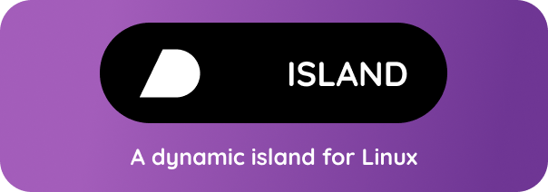

<div align="center">
  
  <h1>Linux Dynamic Island</h1>
  <p>
    <strong>A sleek, macOS-style Dynamic Island for Linux desktops</strong>
  </p>
  <p>
    <a href="https://github.com/orangopus/dynamix-island/issues">
      
    </a>
    <a href="https://github.com/orangopus/dynamix-island/network/members">
      
    </a>
    <a href="https://github.com/orangopus/dynamix-island/stargazers">
      
    </a>
    <a href="https://github.com/orangopus/dynamix-island/blob/master/LICENSE">
      
    </a>
  </p>
</div>

---


## Features
- Displays currently playing song from Spotify
- Expands on hover to show full controls
- Media control buttons (Previous, Play/Pause, Next)
- Always-on-top display
- Semi-transparent black background with rounded corners
- Smooth animations and transitions
- Real-time updates via DBus
- Drag support for repositioning

## Prerequisites
Install the required packages for your distribution:

```bash
# For Ubuntu/Debian
sudo apt install python3-gi python3-dbus gir1.2-gtk-3.0 nodejs npm

# For Fedora
sudo dnf install python3-gobject python3-dbus gtk3 nodejs npm

# For Arch Linux
sudo pacman -S python-gobject python-dbus gtk3 nodejs npm
```

## Installation

1. Clone the repository:
```bash
git clone https://github.com/orangopus/dynamix-island.git
cd linux-dynamic-island
```

2. Install dependencies:
```bash
npm install
```

## Running the Application

1. Make sure Spotify is running and playing music
2. Start the application:
```bash
npm start
```

## Development

To run in development mode with hot reload:
```bash
npm run dev
```

## Configuration

The application can be configured by editing the following files:
- `config.js`: General application settings
- `styles.css`: Visual customization
- `renderer.js`: Behavior and interaction logic

## Troubleshooting

### Common Issues

1. **Island not showing:**
   - Ensure your window manager supports transparency
   - Check if Electron is properly installed

2. **No song information:**
   - Verify Spotify is running
   - Check DBus connection status
   - Ensure required permissions are set

3. **Controls not working:**
   - Verify DBus permissions
   - Check Spotify's DBus integration status

### Debug Mode

Run with debug logging enabled:
```bash
DEBUG=true npm start
```

## Contributing

1. Fork the repository
2. Create your feature branch (`git checkout -b feature/AmazingFeature`)
3. Commit your changes (`git commit -m 'Add some AmazingFeature'`)
4. Push to the branch (`git push origin feature/AmazingFeature`)
5. Open a Pull Request

## License

This project is licensed under the MIT License - see the [LICENSE](LICENSE) file for details.

## Acknowledgments
- Inspired by Apple's Dynamic Island
- Built with Electron and DBus
- Uses Spotify's DBus interface

## Project Structure
```
linux-dynamic-island/
├── src/
│   ├── main.js          # Main Electron process
│   ├── renderer.js      # Renderer process
│   └── styles.css       # Styles
├── config.js            # Configuration
├── package.json         # Dependencies and scripts
└── README.md           # Documentation
```

## Future Plans
- [ ] Support for other media players
- [ ] Customizable themes
- [ ] Additional animations
- [ ] System notifications integration
- [ ] Keyboard shortcuts
- [ ] Hyprland support
